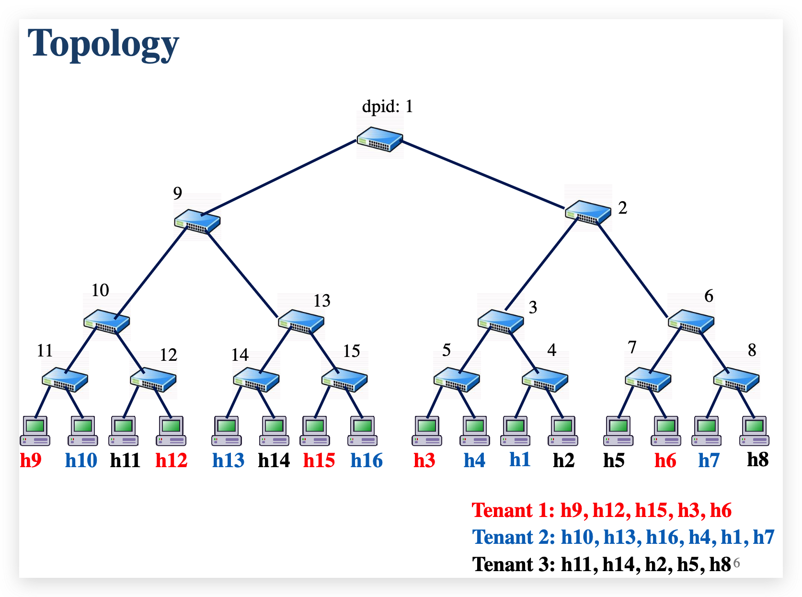

# Data-Center-Networking Project4

Create a virtual Data Center network in mininet and use Ryu controller to make every tenant has their own isolated
network.

## Commands

- Prestart
  
  ```sh
  brew install --cask xquartz
  #export DISPLAY=:0
  export DISPLAY="127.0.0.1:10.0"
  /opt/X11/bin/xhost +local:
  ssh -XY -p 2222 vagrant@127.0.0.1 
  vagrant ssh -- -vvv -XY
  # VM
  AllowTcpForwarding yes
  X11Forwarding yes
  X11DisplayOffset 10
  ```

- Create Topology

  ```sh
  # In order to keep the host environment variables unchanged, add `-E` argument to the mn command. 
  # --topo tree,depth=4 -> 4 層樹
  # With the `--mac` command, host mac address will be fixed. This will make your design easier
  # With the `--arp` command, switch will not broadcast ARP to get corresponding IP, and MAC address pair
  sudo -E mn --controller remote,ip=127.0.0.1 --topo tree,depth=4 --switch default,protocols=OpenFlow13 --mac --arp
  # pingall
  ```

  

- Create ryu controller

  ```sh
  ryu-manager controller.py
  ```

- Start UDP server

  ```sh
  # In mininet
  # h1 python3 utils/server.py &
  xterm h1 h4 h7 h8 h9
  python3 server.py
  ```

- Start UDP client
  
  ```sh
  python3 utils/client.py
  ```

- Clean mininet

  ```sh
  sudo mn -c
  ```

## 參考資料

- [SDN LAB3 — Ryu train](https://sam66.medium.com/sdn-lab3-ryu-train-f8fe13b03548)